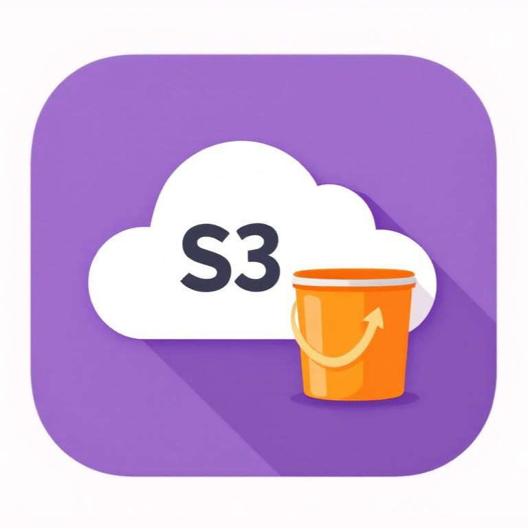

<div align="center" width="150px">
  
</div>
<div align="center">
  <h1>Strapi Provider Upload S3 Compatible</h1>
  <p>A Strapi upload provider for S3-compatible servers. This provider enables Strapi to store and serve media files using S3-compatible server.</p>
  <a href="https://www.npmjs.org/package/strapi-provider-upload-s3-compatible">
    
  </a>
  <a href="https://www.npmjs.org/package/strapi-provider-upload-s3-compatible">
    
  </a>
</div>

---

## Features

- ✅ Upload files to S3-compatible server
- ✅ Delete files from S3-compatible server
- ✅ Generate signed URLs for private files
- ✅ Support for both public and private buckets
- ✅ TypeScript support
- ✅ Full type safety with Zod validation
- ✅ Configurable cache control headers

## Configuration

To use this provider in your Strapi application, configure it in your `config/plugins.ts` file:

```typescript
import type { Config as S3Config } from 'strapi-provider-upload-s3-compatible'

export default {
  upload: {
    config: {
      provider: 'strapi-provider-upload-s3-compatible',
      providerOptions: {
        endPoint: process.env.S3_ENDPOINT,               // your S3 server endpoint
        accessKey: process.env.S3_ACCESS_KEY,            // your S3 access key
        secretKey: process.env.S3_SECRET_KEY,            // your S3 secret key
        region: process.env.S3_REGION,                   // your S3 region
        bucket: process.env.S3_BUCKET,                   // your S3 bucket name
        isPrivate: process.env.S3_IS_PRIVATE === 'true', // true for private, false for public
        folder: process.env.S3_FOLDER || 'strapi',       // folder prefix in bucket
        forcePathStyle: process.env.S3_FORCE_PATH_STYLE === 'true', // true for path style, false for virtual hosted-style
      },
      actionOptions: {
        upload: {
          cacheControl: 'public, max-age=31536000, immutable', // optional
        },
        uploadStream: {
          cacheControl: 'public, max-age=31536000, immutable', // optional
        },
        getSignedUrl: {
          expiresIn: 3600, // optional
        },
      },
    } satisfies S3Config,
  },
}
```

### Private Files

When `isPrivate` is set to `true`, the provider will generate signed URLs for file access. Signed URLs expire after the configured `actionOptions.getSignedUrl.expiresIn` period.

### Public Files

When `isPrivate` is set to `false`, files are accessible via direct URLs without authentication.

## Development

### Scripts

- `pnpm build` - Compile TypeScript to JavaScript in the `dist/` directory
- `pnpm dev` - Watch mode for development
- `pnpm lint` - Run ESLint
- `pnpm lint:fix` - Fix ESLint errors
- `pnpm typecheck` - Type check without emitting files

### Requirements

- Node.js >= 20
- pnpm 10.23.0
or
- Volta.sh

## License

MIT
